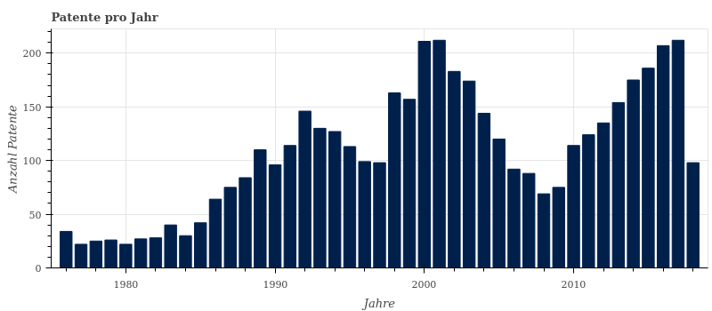
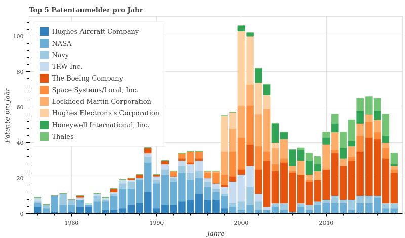
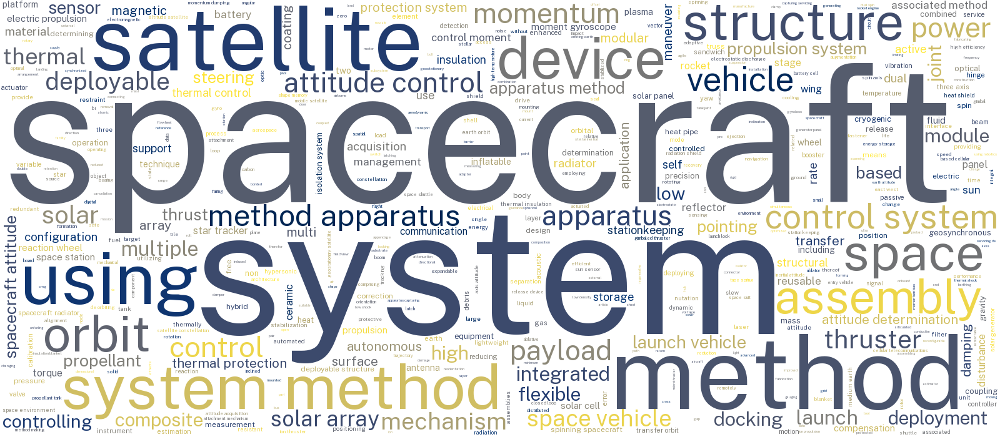

= Cosmonautics: Große Akteure in der Raumfahrt
Jonas Hungershausen <jonas.hungershausen@gmail.com>
Business Intelligence
:doctype: book
:reproducible:
:source-highlighter: rouge
:listing-caption: Aufführung
:figure-caption: Abbildung
:table-caption: Tabelle
:icons: font
:toc:
:toc-title: Inhalt
:title-logo-image: 
:xrefstyle: full

== Einleitung und Analyseziele

Nach dem "Spacerace" der 1950er und 1960er Jahre{empty}footnote:[Wettlauf ins All https://de.wikipedia.org/wiki/Wettlauf_ins_All] stagnierten die Innovationen im Bereich der Raumfahrt.
Nicht zuletzt war dies dem sinkenden Enthusiasmus der Gesellschaft geschuldet.
Die Menschen hatten andere Probleme und da es keinen "Gegner" (die Sowjetunion) mehr gab, sahen immer weniger einen Grund für die Förderung der Raumfahrt.
So wurden öffentliche Gelder in andere Gebiete investiert.

Da die Raumfahrt ein sehr langwieriges Unterfangen ist, gab es auch lange wenig Anreize für private Investoren, in den Bereich zu investieren.
Heute sieht das Bild etwas anders aus:
Innovationen in der Raumfahrt sind vor allem von privaten Firmen geprägt.
Diese haben die Mittel und die CEOs den Enthusiasmus die Menschheit zu einer multi-planetaren Spezies zu machen.

Aus dieser "neuen" Dynamik ergibt sich die Fragestellung dieser Arbeit:
_Wie sieht die wirtschaftliche Landschaft der Raumfahrt aus und welche Parteien waren historisch, und sind heute daran beteiligt?_

Diese Frage wird mithilfe von Analysen der Patente aus dem Bereich beantwortet.
Dabei werden Unternehmen sowohl inhaltlich als auch zeitlich analysiert.
Die Analyse zeigt vor allem wie sich staatliche Akteure immer weiter zurück ziehen und der Markt von privaten Innovateuren übernommen wird.

Zunächst wird die Recherchestrategie erläutert.
Anschließend wird die Analyse durchgeführt und durch eine Zusammenfassung abgeschlossen.

== Recherche

Die Recherche wurde mithilfe der _Patentsview_ Datenbank auf dem Goliath Server durchgeführt.
Außerdem wurde die Patentsuche von Google{empty}footnote:[https://patents.google.com/] zur besseren Einsicht in die Patente eingesetzt.

=== Strategien

Um einen Überblick über die Struktur der Datenbank und die verschieden Patente zu gewinnen wurden die Titel und Abstrakte der Patente nach dem Begriff _"space"_ durchsucht:

.Abfrage nach Raumfahrt Patenten
[source, sql]
----
SELECT * FROM Patentsview.patent p WHERE CONTAINS(p.title, 'space') OR CONTAINS(p.abstract, 'space');
----

Dies brachte leider wenig Erfolg, da sich hier auch Patente wie _"Infrared space heater"_{empty}footnote:[Patent mit der `patent_id` 3934572] in der Ergebnisliste befanden.

Es stellte sich heraus, dass nach Organisationen zu filtern, ein besserer Ansatz war.
Doch auch hier traten schnell Probleme auf.
So ist allein die _NASA_ mit über 20 verschiedenen Namen in der Datenbank vertreten.
Die Analyse sollte sich jedoch nicht nur auf die _NASA_ beschränken, sondern auch andere Firmen beinhalten.
Und auch diese Firmen waren mit verschiedenen Namen vertreten, sodass ein Filtern nach diesen Firmen sehr Unperformant war.

Letztendlich brachte die Recherche unter Berücksichtigung von Gruppen die besten Ergebnisse.
Nach einem Blick auf die Sitemap von Googles Patentsuche eignete sich die Gruppe _Cosmonautics; Vehicles or equipment therefor_{empty}footnote:[https://www.google.com/patents/sitemap/en/Sitemap/B64/B64G.html] am besten zur Analyse.
Dem Namen der Gruppe zu entnehmen enthält sie Patente von Fahrzeugen und Ausrüstung aus der Raumfahrt.
In der _Patentsview_ Datenbank sind 4645 Patente und 790 unterschiedliche _Assignees_ in dieser Gruppe enthalten.

== Analyse

Die nachfolgende Analyse soll sich mit der Entwicklung der Raumfahrt beschäftigen.
Auch soll die Analyse gesellschaftliche Veränderungen, als auch technologische Aspekte mit einbeziehen.
So war die Entwicklung der Raumfahrt lange Zeit durch den Wettkampf der USA mit der Sowjetunion geprägt.
Seit der Auflösung der Sowjetunion in die Balkanstaaten{empty}footnote:[https://de.wikipedia.org/wiki/Sowjetunion] ist dieser Wettkampf nicht mehr die treibende Kraft in dem Gebiet.
Vor allem private Firmen haben diesen Posten eingenommen.

=== Analyse der stärksten Jahre der Raumfahrt

Nachfolgend wird die Verteilung der Anmeldungen von Patenten pro Jahr analysiert.

.Patente pro Jahr
[[patents_by_year]] 

In <<patents_by_year>> ist dargestellt, wie viele Patente in der Gruppe B64G (Cosmonautics) im Zeitraum 1976 - 2018 angemeldet wurden.
Die Patente wurden nach Anmeldejahr gruppiert und als Balkendiagramm dargestellt.

Von 1976 bis 1991 war vor allem das anhaltende Wettrüsten mit der Sowjetunion der Grund für viele Patentanmeldungen.
Als diese 1991 aufgelöst wurde, zog sich auch die USA immer weiter aus der Raumfahrt zurück.
Danach übernahmen hauptsächlich private Unternehmen das Feld.
Dies ist besonders gut an einem Einbruch der Patentanmeldungen um das Jahr 2008 zu erkennen.
Bedingt durch die Weltfinanzkrise{empty}footnote:[https://de.wikipedia.org/wiki/Weltfinanzkrise] konnten die vielen privaten Unternehmen ihr Interesse an der Raumfahrt nicht aufrecht erhalten und mussten das Budget kürzen.

=== Zeitdynamische Analyse der stärksten Patentanmelder 

.Top 5 Patentanmelder pro Jahr
[[top5_orgs_by_year]]

Einen besseren Überblick gibt die Darstellung der 5 größten Patentanmelder im genannten Zeitraum in <<top5_orgs_by_year>>.
Hier werden nur noch NASA und Navy als staatliche Organisationen, sowie Boeing, Lockheed Martin und Thales als private Unternehmen aufgeführt.
Die Beschränkung basiert auf der Anzahl Anmeldungen in der Gruppe B64G.
Die fünf genannten Unternehmen haben die meisten Patentanmeldungen im genannten Zeitraum.

Insgesamt lässt sich erkennen, dass anfangs vor allem staatliche Organisationen Innovationen in der Raumfahrt voran getrieben haben.
Später sind auch immer mehr private Unternehmen dazu gekommen, während sich die staatlichen Organisationen immer weiter zurückzogen.
Hier lässt sich also ein Wandel von Wettrüsten zu Forschungsdrang und Erkundung des Weltalls erkennen.

=== Inhaltliche Analyse der Patente

.Wordcloud Titel
[[wordcloud_title]]

In <<wordcloud_title>> ist eine Wordcloud aus den Titeln der Patente dargestellt.
Je größer das Wort, desto häufiger trat es in den Titeln auf.
Für eine bessere Aussagekraft wurden Stopwörter (wie "_for_", "_of_" und "_and_") nicht berücksichtig.

Das Thema der Arbeit ist klar zu erkennen, da die Wörter _Spacecraft_ (Raumfahrzeug) und _Satellite_ (Satellit) sehr häufig auftritt.
In <<word_frequencies>> sind die genauen Häufigkeiten pro Wort aufgelistet.

// TODO

== Fazit

Diese Arbeit hat einen Einblick in die Patente der Raumfahrt gegeben.
Dabei wurden vor allem die Unterschiede zwischen privaten und staatlichen Akteuren untersucht.
Es wurden inhaltliche als auch zeitliche Unterschiede dargestellt und untersucht.

Aufgrund des beschränkten Umfangs, konnte sich die Arbeit nur auf die größten Organisationen konzentrieren.
Ein umfassenderer Blick auf das Feld kann durch die Berücksichtigung von mehr Akteuren gewonnen werden.

Auch kann nicht gesagt werden, ob alle Patente, die für die Raumfahrt relevant sind, in der Gruppe B64G registriert sind.

Mit der Zunahme von Innovationen aus Asien, konnten zu dem viele Patente nicht berücksichtigt werden, da diese einfach nicht in der _Patentsview_ vorhanden sind.

Eine der vermutlich größten neuen Firmen im Bereich ist _SpaceX_.
Da _SpaceX_ aber keine Patente für seine Innovationen anmeldet{empty}footnote:[https://www.businessinsider.com/elon-musk-patents-2012-11?IR=T], wurden diese auch nicht berücksichtigt.

Zusammenfassend kann gesagt werden, dass nur die Datenbank der amerikanischen Patentbehörde vermutlich kein richtig repräsentatives Bild geben kann.
Für eine umfassendere Analyse müssten auch andere Patentbehörden mit einbezogen werden.

[appendix]
== Abbildungsverzeichnis

- <<patents_by_year>>
- <<top5_orgs_by_year>>
- <<wordcloud_title>>

[appendix]
== Anhang

.Wort Häufigkeiten
[[word_frequencies]]
[format="csv", options="header"]
|===
include::./data/word_frequencies.csv[]
|===